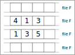
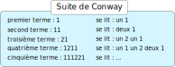

Exercices
=========

Pour les exercices ci-dessous, on utilise l'interface de **file** rappelée ci-dessous:

- ``creer_file()`` fonction qui crée une file vide.
- ``est_vide(F)`` fonction qui prend en paramètre une file F et renvoie un booléen permettant de savoir si la file est vide ou non.
- ``enfiler(F,e)`` fonction qui prend en paramètre une file F et un élément e et l'ajoute à la file.
- ``defiler(F)`` fonction qui prend en paramètre une file F et renvoie la tête de la file en la supprimant.

Exercice 1
----------

On considère une file F contenant dans l'ordre les nombres 1, 11, 111 et 1111; le nombre 1 est la tête de la file.

1. Représenter par un schéma la file F.
2. On enfile la valeur 11111. Quel est le contenu de la file F ?
3. On défile deux fois la file F. Quel est son contenu ?
4. Écrire la suite d'instructions qui permet de créer la file F et réaliser les actions des questions 2 et 3.
5. Écrire un algorithme qui défile la file F tant qu'elle n'est pas vide.

Exercice 2
----------

On donne ci-dessous la représentation d'une file F dans différents états. Donner les instructions en Python qui permettent d'obtenir ces différents états de la file F.

   
Exercice 3
----------

1. En utilisant les listes Python, créer une implémentation de l'interface de file.

.. code:: python

   def creer_file():
       ...
   
   def est_vide(file):
       ...
   
   def enfiler(file,elt):
       ...
   
   def defiler(file):
       ...
   
2. On souhaite compléter cette interface avec 2 nouvelles fonctions : ``tete_de_file`` et ``longueur``.
   
   a. La fonction ``tete_de_file`` prend en paramètre une file et renvoie la valeur de la tête de file sans la supprimer. Si la file est vide, la fonction renvoie ``None``.
   b. La fonction ``longueur`` prend en paramètre une file et renvoie le nombre d'éléments qu'elle contient. La file doit rester dans le même état après avoir renvoyé le nombre d'éléments.
   
   Coder en Python ces 2 fonctions.

Exercice 4
----------

John Conway est un mathématicien et informaticien britannique qui est l'auteur d'une suite numérique particulière. Chaque terme de la suite se déduit du terme précédent par énumération des chiffres qui le constituent.

Cette suite de **Conway** s'appelle *look and say* et se construit à partir d'un chiffre appelé graine. L'objectif de l'exercice est d'écrire les différents termes de la suite de Conway.

#. Donner le prochain terme de la suite de Conway.
#. On utilise 2 files pour écrire les termes de la suite de Conway. La file ``f1`` contient les chiffres d'un terme de la suite et la file ``f2`` contient son énumération sous forme de **tuple**.

   .. figure:: ../img/file_conway.svg
      :align: center
      :width: 400

   Donner les contenus des files ``f1`` et ``f2`` pour les cinquième et sixième terme de la suite de Conway.

#. La fonction ``terme_en_file`` prend en paramètre un terme de la suite sous forme de chaine de caractères et renvoie la file contenant chaque  chiffre de ce terme.

   >>> F1 = terme_en_file('1211') # F1 contient chaque chiffre comme valeur de file

   Écrire en Python la fonction ``terme_en_file`` et la tester avec les premiers termes de la suite de Conway.

#. La fonction ``lire_terme`` prend en paramètre une file ``f`` contenant les chiffres d'un terme de la suite de Conway. Cette fonction renvoie une file qui contient les tuples énumérant les chiffres de la file ``f``.

   >>> F2 = lire_terme(F1) # F2 est une file avec les tuples

   Écrire en Python la fonction ``lire_terme`` et la tester avec les premiers termes de la suite de Conway.

#. La fonction ``terme_suivant`` prend en paramètre une file ``f`` contenant l'énumération des chiffres d'un terme de la suite de Conway et renvoie le terme suivant de la suite sous forme d'une chaine de caractères.

   >>> t_1 = '1'
   >>> t_2 = terme_suivant(F2) # où F2 contient le tuple (1,1) et t_2 vaut alors '11'
   >>> t_3 = terme_suivant(F2) # où F2 contient le tuple (2,1) et t_3 vaut alors '21'
   >>> t_4 = terme_suivant(F2) # où F2 contient les tuples (1,2) et (1,1) et t_3 vaut alors '1211'

#. La fonction ``suite_conway`` prend en paramètre un nombre entier positif **n** et renvoie un tableau qui contient les **n** premiers termes de la suite de Conway construite avec les fonctions ``terme_en_file``, ``lire_terme`` et ``terme_suivant``.

   Écrire en Python la fonction ``suite_conway``.

