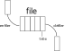

La file
=======

La **file** est une **structure de données linéaire**.

-  on accède uniquement au premier élément ajouté; c'est la **tête de la file**;
-  tout nouvel élément est ajouté à la fin de la file.

Cette structure de donnée est dite **FIFO** pour **First In First Out** (premier arrivé, premier sorti).

   On représente souvent une file de façon horizontale comme une file d'attente.

Pour accéder à un élément situé dans la file, il est nécessaire de
défiler la structure jusqu'à ce que l'élément voulu soit la tête de la file.

Tous les éléments défilés sont perdus sauf si on les sauvegarde
dans une structure de donnée adaptée (liste, pile ou autre file).

.. note::
   :name: remarque

   La **file** est utilisée dans différents types de situations:

   - une imprimante gère les impressions en plaçant les documents à imprimer dans une file d'attente.
   - pour lire ou écrire dans un fichier avec une mémoire tampon utilisée comme une file
   - pour modéliser le jeu de la bataille aux cartes
   - pour parcourir une structure de données

Interface d'une file
--------------------

L'interface d'une file se compose principalement des **primitives** suivantes :

- Créer une file vide, sans contenu;
- Enfiler un nouvel élément, c'est à dire ajouter un nouvel élément en fin de file (dernier arrivé);
- Défiler une file, c'est à dire renvoyer la tête de la file tout en la supprimant de la file;
- Tester si une file est vide.

Implémentation d'une file
-------------------------

La file n'existe pas nativement en Python. **L'implémentation** d'une file peut se réaliser avec des **listes python** ou en **poo**.
Quelle que soit l'implémentation choisie, l'interface reste la seule définition de cette structure.

Les **listes python** disposent de fonctions et de méthodes pour réaliser facilement l'interface d'une file.

- La construction d'une file se fait avec une liste vide;
- Enfiler une valeur se fait avec la méthode **append**;
- Défiler une file se fait avec la méthode **pop**
- Tester une file vide se fait avec un test sur une liste vide.

Les implémentations d'une file peuvent proposer d'autres fonctions comme la **longueur** d'une file ou l'**accès** à la tête de la file sans la défiler.
   
.. admonition:: Exercice résolu

   On considère une file F contenant dans l'ordre les nombres 1, 11, 111 et 1111; le nombre 1 est la tête de la file.

   1. Représenter par un schéma la file F.
   2. On enfile la valeur 11111. Quel est le contenu de la file F ?
   3. On défile deux fois la file F. Quel est son contenu ?
   4. Écrire la suite d'instructions qui permet de créer la file F et réaliser les actions des questions 2 et 3.
   5. Écrire un algorithme qui défile la file F tant qu'elle n'est pas vide.

