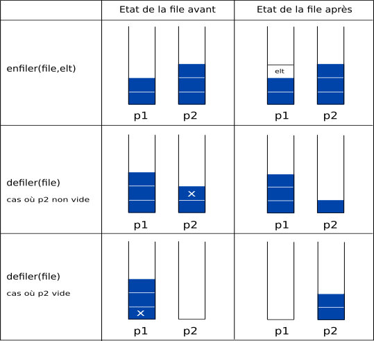

Implémenter une file avec 2 piles
=================================

Ce TP utilise le module :download:`pile <../../pile/python/implementation_poo_pile.py>` qui implémente la structure de pile en programmation objet.

On rappelle les fonctions ou méthodes relatives aux files qui constituent son **interface**.

-  créer une file vide : ``F=creer_file()``
-  enfiler une valeur **e** : ``enfiler(F,e)`` ou ``F.enfiler(e)``
-  défiler une valeur : ``defiler(F)`` ou ``F.defiler()``
-  tester si une pile est vide : ``est_vide(F)`` ou ``F.est_vide()``

On rappelle également l'interface de la pile implémentée en POO:

-  créer une pile vide : **P=creer_pile()**
-  empiler une valeur *e* : **P.empiler(e)**
-  dépiler une valeur : **P.depiler()**
-  tester si une pile est vide : **P.est_vide()**

.. rubric:: Principe de construction d'une file

On choisit d\'**implémenter** une ``file`` à l'aide d'un tableau ``[p1,p2]`` où ``p1`` et ``p2`` sont deux piles. Ainsi ``file[0]`` et ``file[1]`` sont respectivement les piles ``p1`` et ``p2``.

Pour enfiler un nouvel élément ``elt`` dans ``file``, on l'empile dans ``p1``.

Pour défiler ``file``, deux cas se présentent:

-  la pile ``p2`` n'est pas vide : on dépile ``p2``.
-  la pile ``p2`` est vide : on dépile les éléments de ``p1`` en les empilant dans ``p2`` jusqu'à ce que ``p1`` soit vide, puis on dépile ``p2``.

.. rubric:: Questions
   :name: questions

#. Représenter par un schéma le contenu des deux piles après la suite d'instructions suivantes:

   .. code:: python

      F=creer_file()
      enfiler(F,5)
      enfiler(F,7)
      enfiler(F,1)

#. On reprend la file F précédente et on exécute la suite d'instructions suivantes:

   .. code:: python

      defiler(F)
      defiler(F)
      enfiler(F,9)

   Représenter par un schéma le contenu des deux piles

#. On donne ci-dessous la fonction ``creer_file()`` qui crée une file **F** avec 2 piles **P1** et **P2**.

   .. code:: python

      def creer_file():
            P1=creer_pile()
            P2=creer_pile()
            return [P1,P2]

   a) Compléter le fichier ``pile.py`` avec les **fonctions** ou les **méthodes** dans le cas d'une classe ``File`` de l'interface d'une file.
   b) Vérifier que votre implémentation est correcte en réalisant les tests suivants:

      - Créer une file vide **F**;
      - Tester si la file **F** est vide;
      - Enfiler 4 nouvelles valeurs dans la file **F**;
      - Défiler une valeur de la file **F**;
      - Écrire une boucle qui défile la file **F** tant qu'elle n'est pas vide.
   
