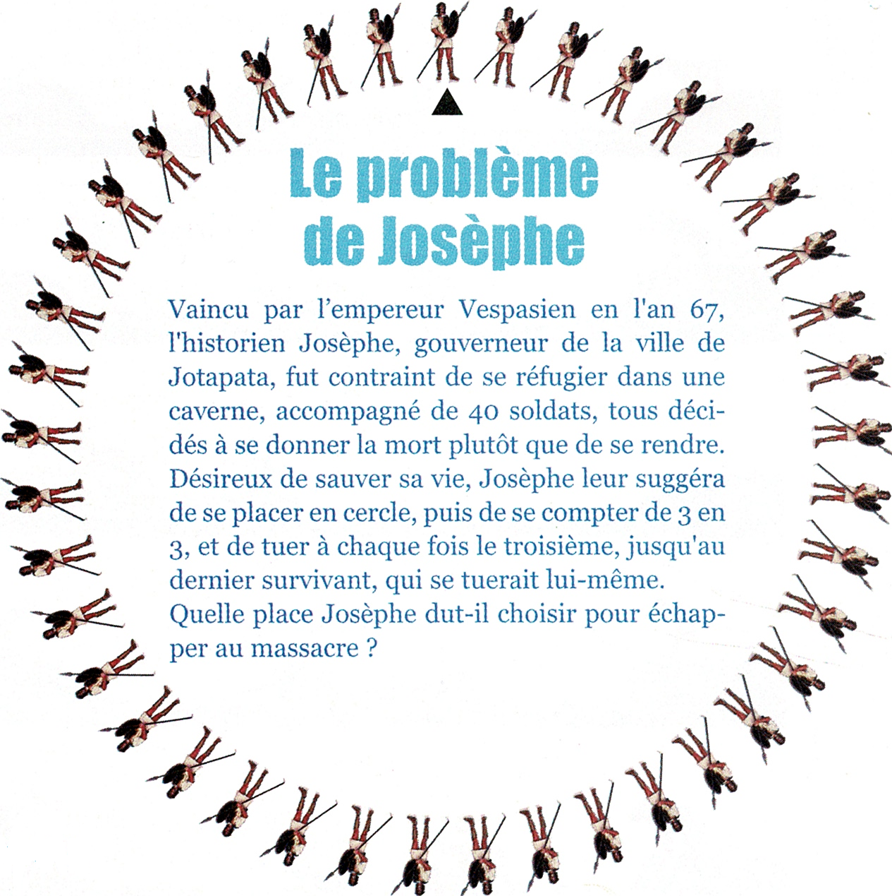

Activité
======================

Le problème de Josèphe est un problème mathématique dont la solution peut être trouvée avec un algorithme.

Proposer une solution algorithmique programmée en Python qui résout ce problème.